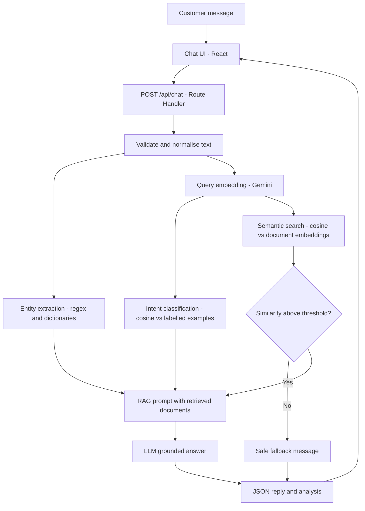

# ShopEase AI Support: Semantic Search Over a Document Corpus

An AI-powered e-commerce customer-support assistant that uses **NLP, semantic search and Retrieval-Augmented Generation (RAG)**.
Built as a single **Next.js** application (frontend + API route + NLP pipeline) and deployable on **Vercel** from a phone browser. It uses the **free tier of the Google Gemini API** (no credit card needed).

> **Demonstration system.** There is no real order database. The assistant explains support processes from a document corpus and never claims to have looked up a real order, payment or refund.

---

## 1. Project overview

A customer types a message such as *"I sent my product back. When will I receive my money?"*. The system:

1. cleans the text,
2. detects the **intent** (for example `REFUND_STATUS`),
3. extracts **entities** (order ID, product, dates ...),
4. converts the message into an **embedding** and performs **semantic search** over a support knowledge base,
5. passes the best documents to an **LLM** that writes a short grounded answer,
6. shows the answer together with the NLP analysis: intent, entities, similarity scores and retrieved documents.

## 2. Problem statement

An e-commerce company receives thousands of messages every day ("Where is my order?", "I want to return my product", "My payment was unsuccessful", "When will I get my refund back?"). Customers phrase the same need in many different ways, so keyword matching fails. The company needs a chatbot that understands the **meaning** of a message, identifies its category and key information, and answers from approved support documents.

## 3. Objectives

- Accept natural-language customer messages.
- Classify the intent into 7 categories.
- Extract useful entities with a simple, explainable method.
- Implement genuine semantic search (embeddings + cosine similarity) over a document corpus.
- Generate answers grounded in the retrieved documents and avoid inventing policies.
- Show the internal analysis so the semantic-search behaviour can be demonstrated and defended.

## 4. Key features

- Mobile-first, responsive chat UI with an **NLP analysis panel** (side panel on desktop, "NLP Analysis" tab on phones).
- Intent scores for all 7 categories, extracted entities, top-3 retrieved documents.
- **Semantic similarity vs keyword overlap** shown side by side for every retrieved document.
- Similarity threshold: if nothing relevant is found, the LLM is not called and a safe fallback is returned.
- Loading, empty and error states; friendly messages for a missing API key, rate limits and API failures.
- API key kept server-side; input validation; basic rate limiting; no stack traces exposed.

## 5. NLP techniques used

| Step | Technique | File |
|---|---|---|
| Text pre-processing | Normalisation, control-character and angle-bracket removal, tokenisation, stop-word removal | `lib/textProcessing.ts` |
| Entity extraction | Regular expressions + dictionaries (rule-based) | `lib/entities.ts` |
| Embeddings | Google Gemini `gemini-embedding-001` (768 numbers per text, task types for queries and documents) | `lib/embeddings.ts` |
| Semantic search | Cosine similarity, top-k ranking | `lib/semanticSearch.ts` |
| Intent classification | Embedding nearest neighbours (few-shot) over labelled example sentences | `lib/intent.ts` |
| Response generation | RAG prompt to `gemini-3.1-flash-lite` | `lib/llm.ts` |

## 6. Concepts explained (viva-friendly)

- **Natural Language Processing (NLP):** getting computers to work with human language: understanding it, extracting information from it and generating it.
- **Intent classification:** deciding *what the customer wants* (track an order, return an item ...). Here it is done by comparing the message embedding with 8 labelled example sentences per intent. The intent whose closest examples are most similar wins.
- **Entity extraction:** pulling out specific details such as an order ID (`ORD12345`), a product (`shoes`), a time (`five days ago`), an amount or a reason (`damaged`). This project uses regexes and dictionaries: simple, transparent, and no training data needed.
- **Embeddings:** a model turns a text into a list of numbers (a vector) so that texts with similar *meaning* get similar vectors, even when they share no words.
- **Cosine similarity:** the cosine of the angle between two vectors: `cos(a, b) = (a · b) / (|a| |b|)`. Close to 1 means very similar meaning, close to 0 means unrelated.
- **Semantic search / document retrieval:** embed every document once, embed the query, compute the cosine similarity to each document and return the highest-ranked ones.
- **Retrieval-Augmented Generation (RAG):** first *retrieve* relevant documents, then let an LLM *generate* an answer using only those documents as context. This keeps answers grounded in company knowledge instead of the LLM's guesses.
- **LLM response generation:** the LLM turns the retrieved text into a short, friendly reply, following rules in a system prompt (no invented policies, no fake order lookups).

### Why this is semantic and not keyword search

The knowledge base says: *"Refunds are generally processed within 5-7 business days after the returned product has been approved."*
The customer writes: *"I sent my product back. When will I receive my money?"*
Very few words are shared ("refund" and "processed" are absent from the query), yet the embedding of the query is close to the embedding of the refund document. The analysis panel shows the **cosine similarity** and the (usually lower) **keyword overlap** for each result.

## 7. Architecture and workflow



**Embedding strategy.** The corpus has 29 documents and there are 56 intent example sentences. On the first request handled by a server instance, they are embedded (one batched API call each, as `RETRIEVAL_DOCUMENT`) and cached in memory for as long as the instance stays warm. Later queries only need **one** embedding call (the query, as `RETRIEVAL_QUERY`) plus one chat call. Every cold start re-embeds these 85 texts, which counts against the free quota (see Limitations). This avoids a separate vector database. For a much larger corpus you would precompute embeddings and store them in a vector database (see Future scope). The first message after a cold start may therefore take a few seconds longer.

## 8. Technology stack

Next.js 15 (App Router) · React 19 · TypeScript · Tailwind CSS 3 · Google Gemini API (plain REST `fetch`, no SDK) · local JSON data · Vercel.

## 9. Project structure

```
ecommerce-semantic-search-bot/
├── app/
│   ├── api/chat/route.ts        # API route: the whole NLP pipeline
│   ├── globals.css
│   ├── icon.svg
│   ├── layout.tsx
│   └── page.tsx
├── components/
│   ├── AnalysisPanel.tsx        # intent, entities, retrieval, response mode
│   ├── ChatWindow.tsx           # chat UI and state
│   ├── MessageBubble.tsx
│   ├── ScoreBar.tsx
│   └── SearchResult.tsx         # one retrieved document with scores
├── data/
│   ├── intent-examples.json     # labelled example sentences per intent
│   └── knowledge-base.json      # the document corpus (29 documents)
├── lib/
│   ├── config.ts                # models, thresholds, limits
│   ├── embeddings.ts            # Gemini embedding call + cosine similarity
│   ├── entities.ts              # rule-based entity extraction
│   ├── errors.ts
│   ├── geminiClient.ts          # server-side REST helper, retries, error mapping
│   ├── intent.ts                # intent classification
│   ├── llm.ts                   # RAG prompt + answer generation
│   ├── rateLimit.ts
│   ├── semanticSearch.ts        # document index + top-k search
│   ├── textProcessing.ts
│   └── types.ts
├── .env.example
├── .gitignore
├── next.config.ts
├── package.json
├── postcss.config.js
├── tailwind.config.ts
└── tsconfig.json
```

## 10. Environment variables

| Name | Required | Default | Purpose |
|---|---|---|---|
| `GEMINI_API_KEY` | **Yes** | none | Server-side Gemini key (free from Google AI Studio). Never put it in code. |
| `GEMINI_CHAT_MODEL` | No | `gemini-3.1-flash-lite` | Chat model used for answers. Change it if Google retires the default. |
| `MIN_SIMILARITY` | No | `0.45` | Minimum cosine similarity for a document to count as relevant |
| `INTENT_MIN_SCORE` | No | `0.5` | Below this intent score the message is labelled Out of Scope |

**The two thresholds are heuristic starting values, not tuned on data.** Cosine scores depend on the embedding model, so calibrate them once: send an off-topic message such as *"What is the capital of France?"* and a few real questions, and read the scores in the NLP Analysis panel. Set `MIN_SIMILARITY` just above the off-topic document score and below the scores of genuine questions (same for `INTENT_MIN_SCORE`), then redeploy. If valid questions get the "no match" fallback, lower the value.

## 11. Deploy from an Android phone (no computer needed)

### A. Get a free Gemini API key
1. Open <https://aistudio.google.com/apikey> in your phone browser and sign in with a Google account.
2. Tap **Create API key** and copy it. No credit card is needed for the free tier.
3. Treat the key like a password: paste it only into Vercel, never into GitHub. The free tier has request limits, so heavy public use can hit them.

### B. Put the code on GitHub
1. Open <https://github.com> in Chrome (menu ⋮ → **Desktop site** makes the editor easier) and sign in.
2. Tap **+ → New repository**. Name it `ecommerce-semantic-search-bot`, tap **Create repository**.
3. On the empty repository page tap **creating a new file**.
4. In the file-name box type the **full path**, for example `package.json` or `app/api/chat/route.ts`. Typing `/` creates folders automatically.
5. Paste the file contents, tap **Commit changes**, then commit.
6. Repeat for every file in the project tree above (use **Add file → Create new file** from now on). Do **not** upload a real `.env` file; only `.env.example`.
7. Double-check that the folders `app`, `components`, `data` and `lib` show the right files.

(GitHub's web upload does not unzip archives. If you have the project as a ZIP, use a small GitHub Action that unpacks it into the repository instead of creating every file by hand.)

### C. Deploy on Vercel
1. Open <https://vercel.com>, tap **Sign Up → Continue with GitHub**.
2. Tap **Add New… → Project**, find `ecommerce-semantic-search-bot` and tap **Import**.
3. Framework Preset should show **Next.js**. Leave the build settings unchanged.
4. Open **Environment Variables**, add name `GEMINI_API_KEY` and paste your key as the value.
5. Tap **Deploy** and wait for the build to finish.
6. Tap **Visit** and test the live URL from your phone.

### Troubleshooting
- **Build fails:** open the build log; the last error line names the file. It is usually a mistyped path or a file that was not created.
- **"AI service is not configured":** add `GEMINI_API_KEY` under *Settings → Environment Variables*, then *Deployments → ⋯ → Redeploy*.
- **"rejected the API key":** the key is wrong or revoked; create a new one in AI Studio and redeploy.
- **"free AI quota is busy or used up":** wait a minute and retry. The free tier has per-minute and per-day limits (the live numbers are shown in Google AI Studio). Each cold start re-embeds the corpus, which uses part of that quota.
- **"could not generate a reply" but analysis works:** the chat model name may have been retired. Set `GEMINI_CHAT_MODEL` in Vercel to a current Flash-Lite model listed on <https://ai.google.dev/gemini-api/docs/models> and redeploy.

## 12. Run locally (optional)

```bash
npm install
cp .env.example .env.local      # then edit .env.local and add your key
npm run dev                     # open http://localhost:3000
```

## 13. Example queries and expected behaviour

Expected categories are the behaviour the design aims for. They are **not measured accuracy figures**. Exact scores depend on the embedding model, and the Out of Scope case (#16) only works as described after you calibrate the thresholds (section 10).

| # | Customer message | Expected intent | Expected top document |
|---|---|---|---|
| 1 | Where is my order? | ORDER_TRACKING | How to Track Your Order |
| 2 | My package hasn't arrived yet. | ORDER_TRACKING | Order Delayed Beyond the Estimated Date |
| 3 | I want to return my shoes. | RETURN_REQUEST | Return Policy / How to Request a Return |
| 4 | The product I received is damaged. | RETURN_REQUEST | Damaged, Defective or Wrong Item Received |
| 5 | My payment failed. | PAYMENT_ISSUE | Payment Failed at Checkout |
| 6 | Why was my card payment declined? | PAYMENT_ISSUE | Card Declined by the Bank |
| 7 | When will I receive my refund? | REFUND_STATUS | Refund Processing Time |
| 8 | I cancelled my order. | CANCELLATION | Refund After Cancellation |
| 9 | Can I cancel my purchase? | CANCELLATION | Cancel an Order Before It Ships |
| 10 | How long does delivery usually take? | DELIVERY_INFORMATION | Standard Delivery Times |
| 11 | I sent my product back. When will I receive my money? | REFUND_STATUS | Refund Processing Time (semantic demo) |
| 12 | I returned my headphones last week but haven't received my money yet. | REFUND_STATUS | Refund Processing Time; entities: product headphones, time last week |
| 13 | I want to return order ORD12345 because the shoes are damaged. | RETURN_REQUEST | Entities: Order ID ORD12345, product shoes, reason damaged |
| 14 | How can I contact customer support? | GENERAL_FAQ | Contacting Customer Support |
| 15 | Where is order ORD12345? | ORDER_TRACKING | The reply explains the process and states that live order data is not available |
| 16 | What is the capital of France? | OUT_OF_SCOPE | Below threshold, so a fallback message is returned |

## 14. Evaluation note (no invented metrics)

This project demonstrates the **methodology**. It does not report accuracy, precision, recall, F1 or latency, because no labelled test dataset was built. To measure intent accuracy, label a few hundred real or realistic messages with their true intent, run them through `classifyIntent`, and compute accuracy and per-class precision/recall on that set. Only then can real numbers be reported.

## 15. Limitations

- No real order, payment or refund data; answers describe policies only.
- Single-turn conversations: there is no conversation memory.
- Entity extraction is rule-based, so unusual phrasings can be missed.
- The corpus is small and fictional (29 documents) and both thresholds are heuristic and uncalibrated.
- Free-tier limits: the quota is small, each cold start spends part of it re-embedding the corpus, and Google states that free-tier content may be used to improve its products, so never type real personal data into the demo.
- Google retires Gemini models over time; the default chat model may need to be replaced via `GEMINI_CHAT_MODEL`.
- The in-memory cache and the rate limiter work per serverless instance and are not shared across instances.
- English only; results depend on a third-party API.

## 16. Future scope

Real e-commerce order database integration · real-time order tracking · multilingual support · larger document corpus · vector database (pgvector, Pinecone ...) · advanced NER models · conversation memory · human-agent escalation · analytics dashboard · voice-based support · WhatsApp integration · production authentication · feedback-based improvement · a labelled evaluation set.

## 17. Academic and use-case significance

The project ties together several NLP topics in one small, deployable system: text pre-processing, information extraction, vector-space semantic representation, similarity-based retrieval, and retrieval-augmented generation. In practice, the same pattern (embed, retrieve, generate with guardrails) is used for real customer-support automation, and the transparent analysis panel makes each stage inspectable.

## 18. Quick viva answers

- **Why embeddings instead of keywords?** They capture meaning, so "get my money back" matches "refund".
- **Why cosine similarity?** It compares direction, not length, and is bounded and easy to interpret.
- **How is hallucination limited?** The LLM only sees retrieved documents, is told not to invent policies, and is not called at all when nothing is similar enough.
- **Why no vector database?** 29 documents fit in memory; a database adds cost and complexity without benefit at this size.
- **Is the accuracy known?** No. There is no labelled dataset, and this README says so explicitly.
